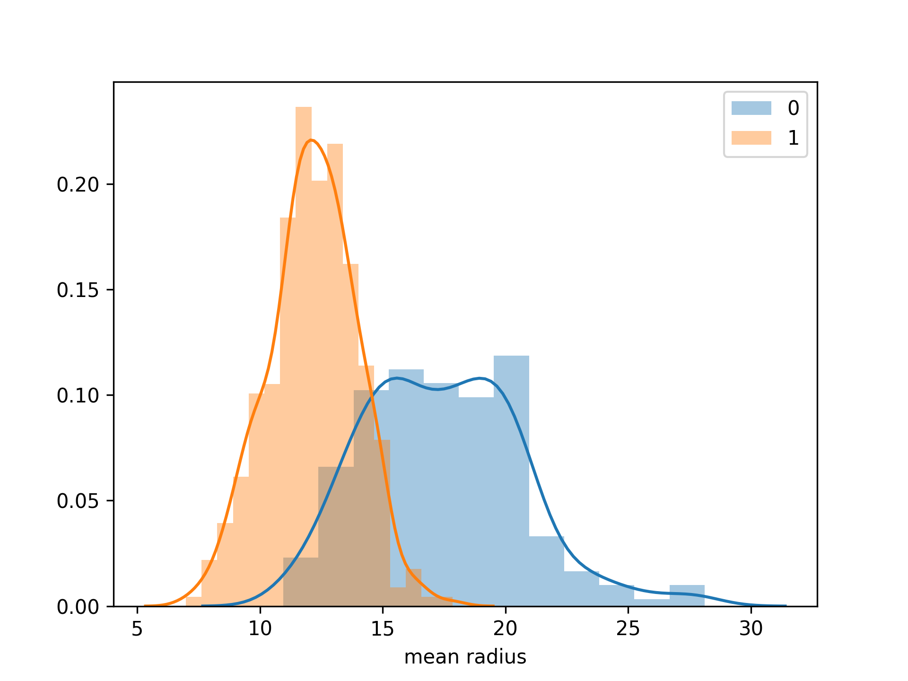

# Final_Project

Instructions and template for final projects.

| Name | Date |
|:-------|:---------------|
|Francina Sibanda| 14 June 2019|

-----

### Resources
The repository includes the following:

- Python script for your analysis: final-project-code.py
- Results figure/saved file: mean_radius_distribution.png
- Dockerfile for your experiment: Dockerfile
- runtime-instructions in a file named RUNME.md: RUNME.md

-----

## Research Question

- Based on the features for a given breast mass sample, how do we determine if the sample is malignant or benign. 

### Abstract

To better understand to understand the characteristics of each feature and how each feature differs in a malignant compared to benign diagnosis. Using the breast cancer dataset form sklearn. Using logistic regression classification model I can determine if the model can be trained to predict the class and the accuracy level of prediction.

  
### Introduction

The detailed decription of the dataset is from Kaggle and Slearn website. 
The data set is from the sklearn website, the features are computed from a digitized image of a fine needle aspirate (FNA) of a breast mass. They describe characteristics of the cell nuclei present in the image. The sample size is 569 and there are 32 variables. The 32 variables comprise of an ID variable, a diagnosis variable indicating a benign or malignant, and 30 measurement variables detailing the size and shape of the cell nuclei. The diagnosis, a categorical variable, is our response variable and the 30 measurement variables, all of which are continuous, are our potential explanatory variables for our model. The 30 measurement variables are actually only 10 different features of the nucleus, but with 3 different measurements of each; the mean, the standard error and the ‘worst’ or largest (mean of the three largest values). The 10 features included are indicated below:

Data Set Characteristics:
Number of Instances:
 	569
Number of Attributes:
 	30 numeric, predictive attributes and the class

Attribute Information:
 	
- radius (mean of distances from center to points on the perimeter)
- texture (standard deviation of gray-scale values)
- perimeter
- area
- smoothness (local variation in radius lengths)
- compactness (perimeter^2 / area - 1.0)
- concavity (severity of concave portions of the contour)
- concave points (number of concave portions of the contour)
- symmetry
- fractal dimension (“coastline approximation” - 1)
- The mean, standard error, and “worst” or largest (mean of the three largest values) of these features were computed for each image, resulting in 30 features. For instance, field 3 is Mean Radius, field 13 is Radius SE, field 23 is Worst Radius.
- class:
WDBC-Malignant
WDBC-Benign

### Methods

I determined that this is a clasification problen, and i would need to use logistic regression classifier model because the dataset has two categories for the output values, Malignant and Begnin. To understand how the attributes of the features relate to each other and their values to the diagnosis predictions, I generated a distribution plot for visulaisation to determine if the two classes can be seperated. The logistic regression model determined the class to evaluate if the diagnosis can be predicted with accuracy. I identified the target variable as the class. For model comparison, I also used KNeighbors and determined that the logistic regression model was more accurate.

I performed the steps below in brief:

- Imported the dataset from sklearn library
- Imported other necessarry libraries (Matplotlib,Numpy,Pandas,Seaborn)
- Loaded breast cancer data set from sklearn
- Transformed the breast cancer_data into a DataFrame with all the features as columns
- Brought in 'target' column into breast cancer_df DataFrame from breast cancer data
- Assigned variables to data and target
- Train the logistic regression model
- Evaluate the Logistic regression model by looking at the generated results after running the model.
- Train the K-Neigbours (Training KNeighbours Classifier model with fit())
- Evaluate the K-Neighbours model by looking at the generated results after running the model.
- Visualise each feature distribution on the two targets/classes
   
 
- As part of exploratory analysis I generated a pairplot for visualisation:
  

 

### Results

The results indicate that the Logistic regression model performs better as it produced more accurate results compared to the KNeighbours model.  

 - Through visualisation we can see that the targets can be classified into the two classes.

- Logistic Classification Report

The LogisticRegression Classification Report indicats a 98% predection accuracy scoare.

LogisticRegression Accuracy score is 0.98 

              precision    recall  f1-score   support

           0       0.99      0.96      0.97        73
           1       0.98      0.99      0.98       127

    accuracy                           0.98       200
   macro avg       0.98      0.98      0.98       200
weighted avg       0.98      0.98      0.98       200

LogisticRegression Confusion Matrix\
[[ 70   3]\
 [  1 126]]
 
 
LogisticRegression Overall f1-score
0.978298611111111
LogisticRegression Cross validation score:[0.93913043 0.94782609 0.98230088 0.9380531  0.96460177]

LogisticRegression ShuffleSplit val_score:[0.9122807  0.98245614 0.98245614 0.9122807  0.9122807 ]

- K-Neighbours
KNeighbours Accuracy score is 0.96

KNeighbours Classification Report
              precision    recall  f1-score   support

           0       0.91      0.99      0.95        73
           1       0.99      0.94      0.97       127

    accuracy                           0.96       200
   macro avg       0.95      0.97      0.96       200
weighted avg       0.96      0.96      0.96       200

KNeighbours Confusion Matrix\
[[ 72   1]\
 [  7 120]]
 
KNeighbours Overall f1-score
0.9575551782682513
KNeighbours Cross validation score:[0.87826087 0.92173913 0.94690265 0.9380531  0.91150442]

KNeighbours ShuffleSplit val_score:[0.89473684 0.89473684 0.94736842 0.94736842 0.87719298]

### Discussion

The Logistic regression method resolved the problem, I was able to train the model to categorise the samples betwen the two classes. 
One of the things we can do to improve the accuracy of the model would be to scale the data for standardisation.

### References
- Sources
https://www.kaggle.com/shravank/predicting-breast-cancer-using-pca-lda-in-r | https://scikit-learn.org/stable/datasets/index.html#breast-cancer-wisconsin-diagnostic-dataset

-------
